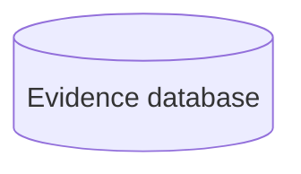
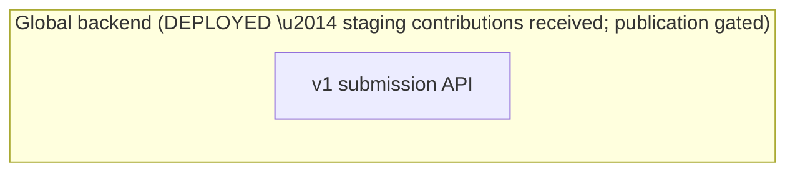
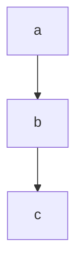
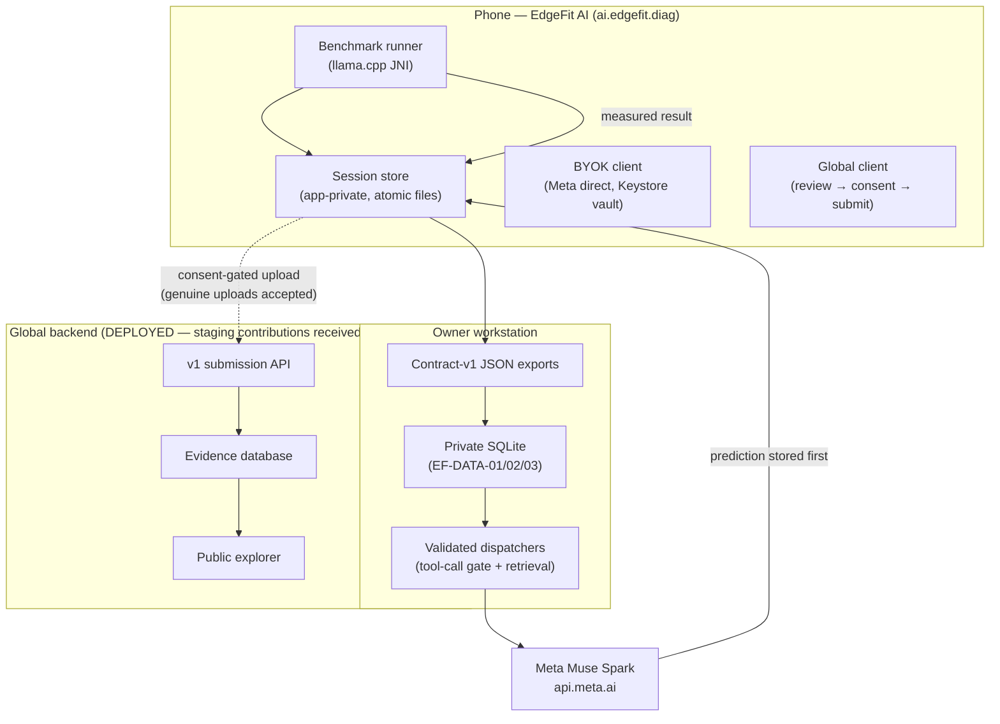

# Mermaid probe (temporary)
## P1 cylinder

```mermaid
flowchart TB
    GDB[("Evidence database")]
```
## P2 semicolon-subgraph

```mermaid
flowchart TB
    subgraph Cloud["Global backend (DEPLOYED \u2014 staging contributions received; publication gated)"]
        API["v1 submission API"]
    end
```
## P3 chains

```mermaid
flowchart TB
    A["a"] --> B["b"] --> C["c"]
```
## P4 full rect+comma

```mermaid
flowchart TB
    subgraph Phone["Phone — EdgeFit AI (ai.edgefit.diag)"]
        Bench["Benchmark runner\n(llama.cpp JNI)"]
        Sess["Session store\n(app-private, atomic files)"]
        BYOK["BYOK client\n(Meta direct, Keystore vault)"]
        Contrib["Global client\n(review → consent → submit)"]
    end
    subgraph Desk["Owner workstation"]
        JSON["Contract-v1 JSON exports"]
        Lite["Private SQLite\n(EF-DATA-01/02/03)"]
        Disp["Validated dispatchers\n(tool-call gate + retrieval)"]
    end
    Muse["Meta Muse Spark\napi.meta.ai"]
    subgraph Cloud["Global backend (DEPLOYED — staging contributions received, publication gated)"]
        API["v1 submission API"]
        GDB["Evidence database"]
        Web["Public explorer"]
    end

    Bench --> Sess --> JSON --> Lite --> Disp --> Muse
    Muse -->|"prediction stored first"| Sess
    Bench -->|"measured result"| Sess
    Sess -.->|"consent-gated upload\n(genuine uploads accepted)"| API
    API --> GDB --> Web

```
## P5 full rect-only

```mermaid
flowchart TB
    subgraph Phone["Phone — EdgeFit AI (ai.edgefit.diag)"]
        Bench["Benchmark runner\n(llama.cpp JNI)"]
        Sess["Session store\n(app-private, atomic files)"]
        BYOK["BYOK client\n(Meta direct, Keystore vault)"]
        Contrib["Global client\n(review → consent → submit)"]
    end
    subgraph Desk["Owner workstation"]
        JSON["Contract-v1 JSON exports"]
        Lite["Private SQLite\n(EF-DATA-01/02/03)"]
        Disp["Validated dispatchers\n(tool-call gate + retrieval)"]
    end
    Muse["Meta Muse Spark\napi.meta.ai"]
    subgraph Cloud["Global backend (DEPLOYED — staging contributions received; publication gated)"]
        API["v1 submission API"]
        GDB["Evidence database"]
        Web["Public explorer"]
    end

    Bench --> Sess --> JSON --> Lite --> Disp --> Muse
    Muse -->|"prediction stored first"| Sess
    Bench -->|"measured result"| Sess
    Sess -.->|"consent-gated upload\n(genuine uploads accepted)"| API
    API --> GDB --> Web

```
